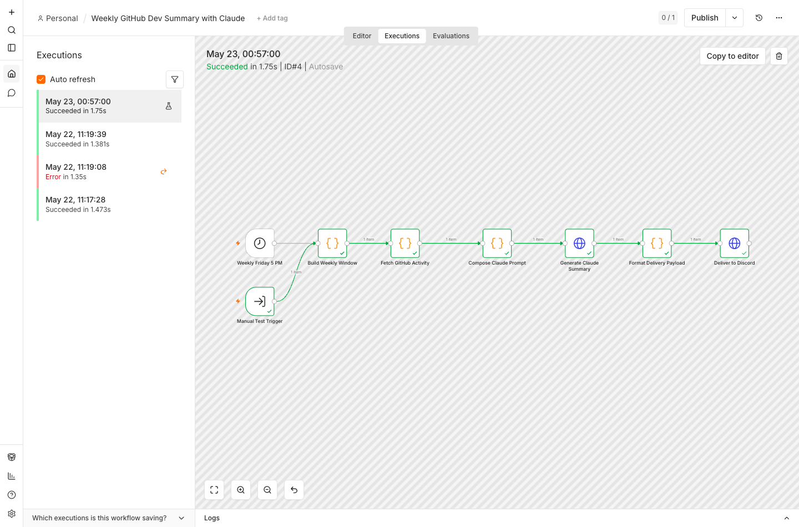

# Test Evidence

Validated locally on May 22, 2026.

## Commands

```bash
node workflows/n8n-weekly-dev-summary/tests/validate-workflow.mjs
npm_config_cache=/tmp/npm-cache-n8n \
  N8N_USER_FOLDER=/tmp/n8n-weekly-summary-test \
  N8N_ENFORCE_SETTINGS_FILE_PERMISSIONS=false \
  npx -y n8n@2.21.7 import:workflow \
    --input workflows/n8n-weekly-dev-summary/workflow.json

npm_config_cache=/tmp/npm-cache-n8n \
  N8N_USER_FOLDER=/tmp/n8n-weekly-summary-test \
  N8N_ENFORCE_SETTINGS_FILE_PERMISSIONS=false \
  N8N_BLOCK_ENV_ACCESS_IN_NODE=false \
  GITHUB_REPO=claude-builders-bounty/claude-builders-bounty \
  SUMMARY_LANGUAGE=EN \
  ANTHROPIC_API_KEY=test_key \
  ANTHROPIC_BASE_URL=http://127.0.0.1:18888 \
  DISCORD_WEBHOOK_URL=http://127.0.0.1:18888/discord \
  npx -y n8n@2.21.7 execute --id weekly-github-dev-summary-claude
```

## Result

- Static workflow validation passed.
- n8n 2.21.7 imported the workflow successfully.
- n8n 2.21.7 executed the workflow successfully with status `success` and `lastNodeExecuted` = `Deliver to Discord`.
- The execution called the real GitHub API for commits, closed issues, and merged PRs.
- Local mock endpoints captured:
  - `POST /v1/messages` with model `claude-sonnet-4-20250514`
  - `POST /discord` with the formatted weekly summary payload

## Screenshot



The screenshot shows execution ID `#4` from May 23, 2026, completing successfully in n8n with every node green from `Manual Test Trigger` through `Deliver to Discord`.

## Expected n8n Manual Execution

Production execution requires live `ANTHROPIC_API_KEY` and `DISCORD_WEBHOOK_URL` values. With those configured, click **Execute workflow** in n8n and confirm:

- GitHub commits, closed issues, and merged PRs are fetched for the last seven days.
- Claude response is generated with `claude-sonnet-4-20250514`.
- Discord receives a message headed `Weekly Dev Summary`.

The workflow is intentionally inactive on import so teams can set credentials and run the first manual execution before enabling the Friday 5 PM schedule.
